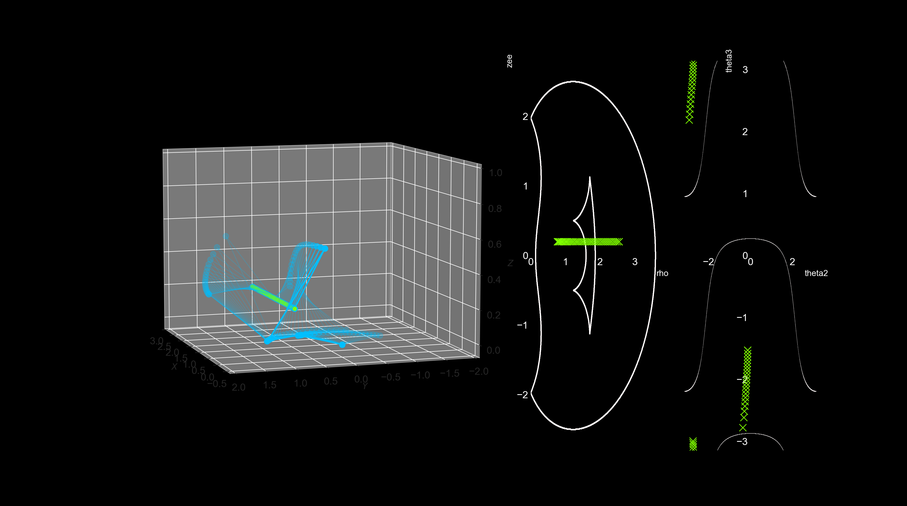

# cuspidal

Researching and visualizing cuspidal robots. This code was used to generate animations and figures in the Medium blogs [Why hasn't anyone heard of Cuspidal robots?](https://achille0.medium.com/why-has-no-one-heard-of-cuspidal-robots-fa2fa60ffe9b) and [Cuspidal Robots: A True Double-edged Sword](https://achille0.medium.com/under-the-radar-cuspidal-robots-7091eca01271).




## Installation

```bash
python3 -m  pip install .
```

## Usage

Modify the [execute_path script](scripts/execute_path.py):

1. Pick a kinematics model from [arm_ik](src/cuspidal/arm_ik.py) or make your own by specifying DH parameters. Currently only 3DOF arms are supported
2. Pick a visualizer, either Maya or Matplotlib. Maya will display the singularity surfaces in 3D, Matplotlib will show separate figures with a 2D version of the singularity surfaces.
3. Show a posture, a set of IK solutions, or display a path by uncommenting the relevant section.
4. Run it:

```bash
python3 scripts/execute_path.py
```
